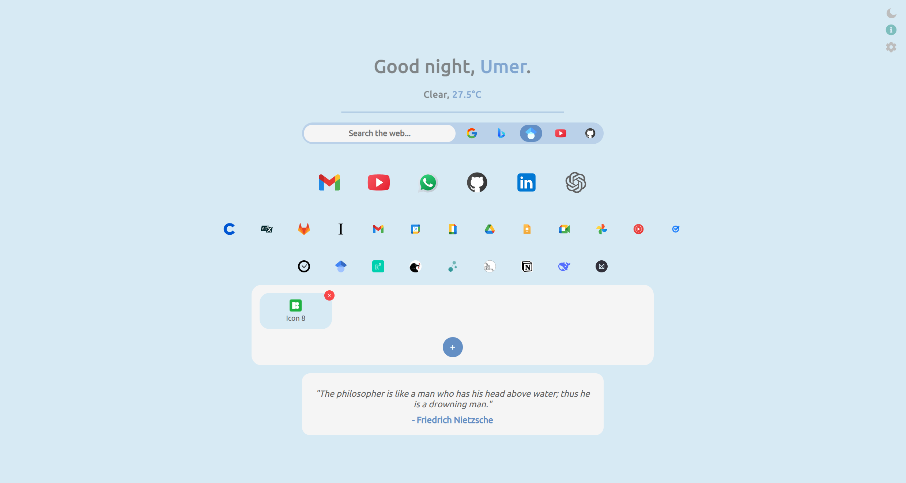

# My Web Homepage



## Features

- **Weather Integration**: Enter your API key and city to receive real-time weather updates. Easily switch between Celsius and Fahrenheit.
- **Personalized Greetings**: Customize the greeting message to make your homepage feel more personal.
- **Theme Customization**: Adjust background, text, and accent colors to match your style.
- **Quick Access Links**: Instantly open Gmail, YouTube, WhatsApp, and other favorite sites.
- **Unified Search**: Use a powerful multi-search engine system for all your search needs.
- **Dynamic Links Manager**: Add, remove, and organize your favorite links with custom icons.
- **Inspirational Quotes**: Get a random motivational quote on each page load.

## Setup

### 1. Clone the Repository
```bash
git clone https://github.com/umerghafoor/My-Home.git
cd My-Home
```

### 2. Configure API Key (Optional but Recommended)

For security, your Weather API key should be stored in a config file that's not tracked by git.

**Option A: Using config.js (Recommended)**
1. Copy the example config file:
   ```bash
   cp js/config.example.js js/config.js
   ```
2. Edit `js/config.js` and add your Weather API key:
   ```javascript
   const config = {
       WEATHER_API_KEY: 'your_actual_api_key_here'
   };
   ```

**Option B: Manual Entry**
- Open the homepage in your browser
- Click the settings icon (⚙️)
- Enter your API key in the Weather section

### 3. Get Weather API Key

1. Visit [WeatherAPI.com](https://www.weatherapi.com/)
2. Sign up for a free account
3. Copy your API key from the dashboard
4. Add it to `js/config.js` or enter it via the settings UI

### 4. Open in Browser

Simply open `index.html` in your web browser!

## File Structure

```
My-Home/
├── index.html              # Main HTML file
├── css/
│   ├── style.css          # Main styles
│   └── sidebar.css        # Sidebar styles
├── js/
│   ├── config.js          # API keys (not tracked in git)
│   ├── config.example.js  # Example config file
│   ├── weather.js         # Weather functionality
│   ├── quotes.js          # Random quotes
│   ├── links-manager.js   # Dynamic links management
│   ├── theme.js           # Theme customization
│   ├── greeting.js        # Personalized greeting
│   └── search-engines.js  # Multi-search engine
├── Icons/                 # Icon assets
├── .env.example          # Example environment file
└── .gitignore            # Git ignore rules
```

## Security Notes

⚠️ **Important**: Never commit your actual API keys to git!

The following files are automatically ignored by git:
- `.env` - Environment variables
- `js/config.js` - JavaScript config with API keys

Always use the example files (`.env.example`, `config.example.js`) as templates.

## Contributing

Have ideas or suggestions? Open an issue or submit a pull request—your feedback is welcome!
